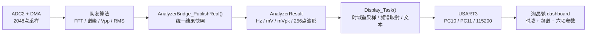
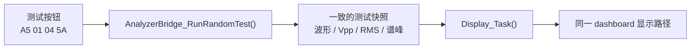

# V1.4 融合架构说明

更新时间：2026-07-30
冻结工程：`firmware`
状态：HMI模拟器稳定回归通过，可作为后续微调基线

## 1. 当前架构结论

V1.4不是把显示工程和队友工程的两个`main.c`直接拼接，而是以队友最新版
工程作为硬件、ADC、DMA、定时器和信号算法基线，在其上增加两层：

1. `AnalyzerBridge`：把队友算法的分散结果整理为稳定、统一、带单位的
   `AnalyzerResult`快照；
2. `display`：消费该快照，完成时域、频谱、文本和HMI按钮交互。

当前主链路为：



测试链路与真实链路在`AnalyzerResult`之后完全相同：



测试按钮不伪造ADC输入，也不调用另一套FFT。它模拟的是“队友已经完成一次
分析”后的最终结果，因此可以单独验证显示和接口链路。

## 2. 初始化链路

`main.c`保留CubeMX和队友工程的外设初始化，只在用户代码区域加入融合入口：

```text
HAL_Init()
→ SystemClock_Config()
→ GPIO / DMA / DAC / USART3 / ADC2 / TIM3初始化
→ ADC单端校准
→ 启动TIM3
→ 启动ADC DMA循环采集2048点
→ AnalyzerBridge_Init()
→ Display_Init(&huart3)
→ while(1)
```

`Display_Init()`的实际顺序为：

```text
保存USART3句柄
→ 清空HMI解析状态
→ 清除UART ORE并刷新RDR
→ 启动HAL_UART_Receive_IT()逐字节接收
→ 等待HMI启动
→ 发送page dashboard
→ 等待HMI上报A5 20 01 time_id spec_id 5A
```

只有收到完整6字节初始化帧后，`s_dashboard.valid`才会置位。这样两条曲线均
使用当前HMI工程实际的数字ID，不再依赖历史硬编码值。

## 3. 真实信号处理链路

ADC DMA完成后，原队友流程继续在主循环运行：

1. 将`adc_b[2048]`转换为伏特值，写入复数FFT输入和`VO`；
2. 执行队友原有`fft()`，得到`F/V`、`FB/VB`、`FC/VC`以及`flag`；
3. 在第一次FFT后立即保存2至3个谱峰；
4. 执行`Vpp_Robust()`得到峰峰值；
5. 执行队友原有`Vpp_R()`得到真有效值。

第3步不能省略。`Vpp_R()`内部会再次调用`fft()`并覆盖共享谱峰全局变量，
因此必须先保存第一次FFT的结果，再继续后续计算。

所有结果完成后调用：

```c
AnalyzerBridge_PublishReal(
    adc_b,
    ADC_SIZE,
    ADC_VOLTS_PER_CODE,
    ADC_SAMPLE_RATE_HZ,
    vpp,
    Vrms,
    flag,
    spectrum_frequencies_hz,
    spectrum_amplitudes_v
);
```

桥接层完成：

- 校验队友`flag`是否表示2或3个有效分量；
- 频率统一使用Hz；
- 峰峰值、RMS和谱线峰值统一转换为mV；
- 谱峰按频率升序排列，最低有效频率作为当前基频；
- 根据采样率和基频从ADC码中抽取一个周期；
- 线性插值为256个显示点并去除均值；
- 最后写入`sequence`和`valid`，形成稳定快照。

当前“最低有效谱峰即基频”仍是待队友确认的算法假设，不属于显示层决定。

## 4. 统一结果结构

显示层只依赖`AnalyzerResult`：

```text
valid / sequence / source
fundamental_hz
vpp_mv / vrms_mv
component_count
components[3]：frequency_hz + amplitude_mv
waveform_count
waveform_mv[256]
status_flags
```

其意义是隔离两边变化：

- 队友可以继续调整FFT、Vpp和RMS算法；
- 显示可以继续调整页面和绘图；
- 只要`AnalyzerResult`语义不变，两侧不需要互相读取散乱全局变量。

`AnalyzerResult`包含256个`float`波形点，大小为1084字节。它大于启动文件
配置的1 KB主栈，因此发布缓存和显示缓存均采用模块级静态对象，不再作为
函数局部变量。

## 5. 显示链路

`Display_Task()`在主循环中执行，不在ADC或UART中断中做耗时绘图：

```text
检查AnalyzerResult.sequence
→ 取得稳定快照
→ 根据pending action决定完整刷新、1T、3T、刷新或测试
→ 时域映射
→ 频谱映射
→ 六项文本
```

### 5.1 时域

- 输入：一个周期的256点`waveform_mv`；
- 输出：794个8位曲线点；
- 1T/3T通过重采样时的周期倍率控制；
- 横向使用线性插值，不修改原波形相对形状；
- 纵向根据当前波形最大绝对值自动选取对称满量程，并保留10%余量。

### 5.2 频谱

- 不再执行显示侧DFT；
- 直接使用`components[0..2]`；
- 横轴固定为0至500 kHz；
- 纵向以当前最大谱线为基准自动缩放；
- 保留淘晶驰整帧写入方向修正，保证低频位于左侧。

### 5.3 文本

显示：

```text
Upp
Urms
f1
基波频率/峰值
谐波1频率/峰值
谐波2频率/峰值
```

为避免不同嵌入式C库配置下浮点`printf`不可用，代码先将浮点数转换为定点
整数，再用`%lu`拼接小数。文本更新不再被频谱局部失败阻断。

## 6. HMI通信与并发

HMI到MCU：

| 帧 | 作用 |
|---|---|
| `A5 20 01 time_id spec_id 5A` | dashboard就绪并上报两条曲线ID |
| `A5 01 01 5A` | 显示1T |
| `A5 01 02 5A` | 重新加载dashboard |
| `A5 01 03 5A` | 显示3T |
| `A5 01 04 5A` | 随机注入一组完整测试结果 |

曲线继续使用：

```text
cle id,0
→ addt id,0,794
→ FE FF FF FF
→ 794字节数据
→ FD FF FF FF
```

接收端使用USART3逐字节中断：

- ISR只负责收字节、解析帧并设置`pending action`；
- 曲线生成和UART批量发送仍在主循环执行；
- UART错误回调清除ORE、丢弃残缺帧并立即重新挂接接收；
- FE/FD由中断解析为状态，再由主循环同步等待。

这避免2048点FFT和排序占用主循环期间漏收短按钮帧。

## 7. 与V1.4原任务书的差异

| 原设想 | 当前稳定实现 | 原因 |
|---|---|---|
| 显示通信拆为`tjc_hmi.c/.h` | 通信、协议与绘图私有函数集中在`display.c` | V1.3.1已验证基线就是单`display`模块，避免再次重构引入回归 |
| `AnalyzerBridge_UpdateFromTeammate()`读取全局变量 | 在一次完整分析结束处调用`AnalyzerBridge_PublishReal()` | Vpp和RMS是主循环局部变量，发布调用更清楚且避免散乱`extern` |
| 页面切换后重画当前页面 | dashboard单页面同时显示时域和频谱 | 当前HMI已定型为单页面布局 |
| UART主循环轮询 | UART逐字节中断接收，绘图仍在主循环 | FFT长任务会造成轮询接收ORE，必须解耦接收时序 |
| `AnalyzerResult`可作普通局部变量 | 大快照使用静态RAM | 单对象1084字节，超过1 KB主栈 |

这些差异均为保持现有已验证页面、避免运行时故障所做，不改变G题需要显示的
时域、频谱和测量结果。

## 8. 当前冻结边界

后续微调前保持不变：

- 以`firmware`为唯一融合基线；
- 不修改`teammate/archive/adc_newest`和`archive/firmware/tjc_display_demo`；
- 不改变ADC2、DMA、TIM3、USART3和队友FFT主流程；
- 不改变dashboard 6字节初始化帧和四个按钮帧；
- 不改变动态曲线ID、794×145尺寸和FE/FD握手；
- 不把曲线发送放入中断；
- 不把`AnalyzerResult`大对象重新放回1 KB主栈；
- 不恢复显示侧DFT；
- 不取消测试覆盖锁存，除非正式构建将`ANALYZER_TEST_ENABLE`设为0。

后续允许的微调：

- 模拟前端增益、偏置和幅值标定；
- 真实采样率与500 Hz频率分辨率校准；
- 队友基频/谐波识别算法修正；
- 第三问抗1 MHz以上干扰处理；
- 实体屏、真实信号和2秒响应时间回归。
