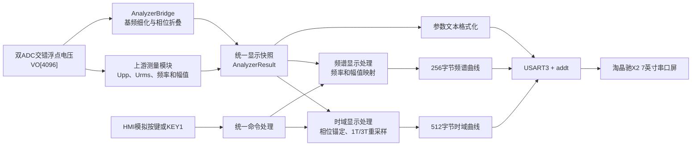
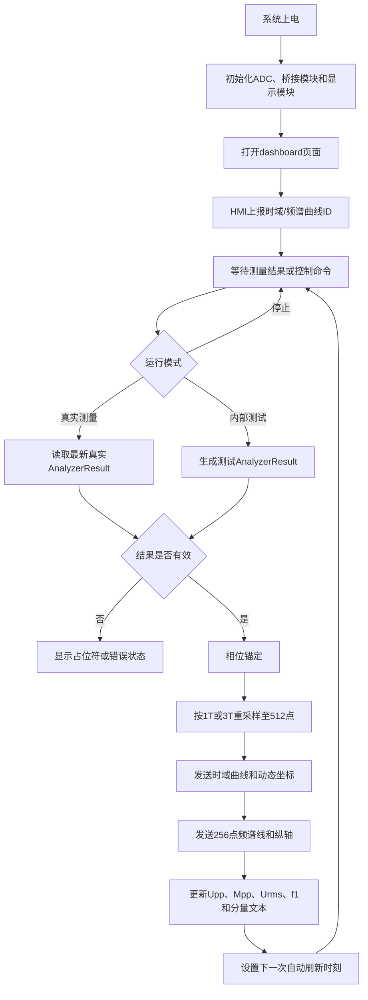
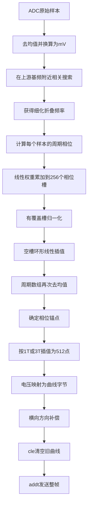
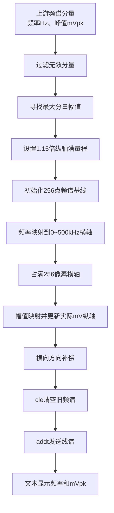
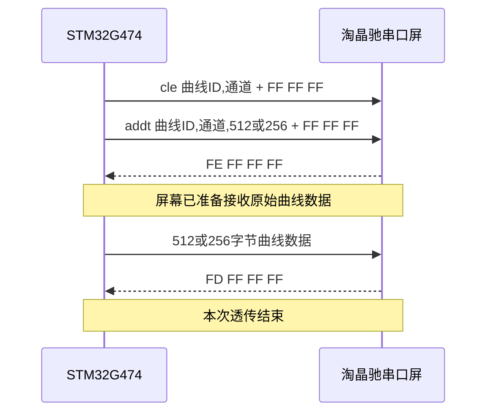
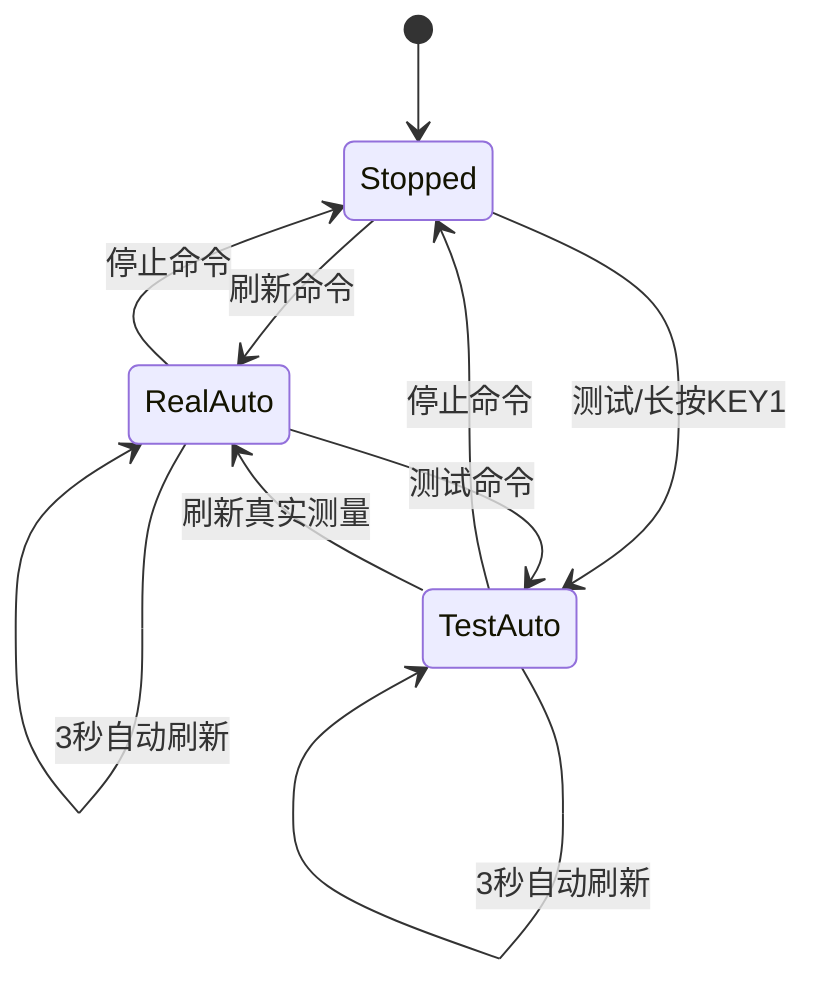

# 周期信号测量分析装置显示与波形重建模块设计

> 文档性质：设计报告素材稿
> 适用题目：2026 年北京市大学生电子设计竞赛 G 题“周期信号测量分析装置”
> 编写范围：显示、桥接、时域波形重建、频谱显示、串口屏通信及人机交互
> 不包含内容：ADC 模拟前端、ADC 采样驱动、频率与幅值测量算法、FFT/Goertzel 测量算法的内部设计
> 当前实现基线：`v2.1.0 / firmware`

## 使用说明

本文不是最终提交的完整设计报告，而是按照《北京市大学生电子设计竞赛设计报告模板（2026）》的章节形式整理的显示模块素材。后续汇总总报告时，可分别并入：

| 本文内容 | 建议并入总报告 |
|---|---|
| 系统职责划分、方案比较、总体框图 | 第 1 章“系统方案” |
| 相位折叠、插值、坐标映射和传输时间计算 | 第 2 章“理论分析与计算” |
| 硬件连接、软件流程、通信协议 | 第 3 章“硬件与软件程序设计” |
| 测试项目、结果表和误差来源 | 第 4 章“测试方案与测试结果” |
| 模块特点和局限性 | 第 5 章“结论” |

最终转入 Word 时，应使用小四号宋体、固定值 22 磅行距，并为图、表和公式连续编号。正文总页数还需与其他模块共同控制在模板规定的 8 页以内。

---

# 1 系统方案

## 1.1 显示任务与设计边界

根据 G 题题面及官方问答，显示模块需完成以下任务：

1. 稳定显示被测周期信号的时域波形；
2. 根据选择，在同一显示区域中显示 1 个或 3 个完整周期；
3. 显示输入信号峰峰值 \(U_{\mathrm{pp}}\)、真有效值 \(U_{\mathrm{rms}}\) 和基频 \(f_1\)；
4. 在正频率轴上显示离散幅度线谱；
5. 显示基波及最多两个谐波分量的频率与峰值幅度；
6. 在启动或选择操作后 2 s 内给出相应图形或数据；
7. 显示屏尺寸不小于 6 英寸。

本装置采用 7 英寸、800×480 分辨率的淘晶驰 X2 系列串口屏。考虑到实物屏幕不可触摸，保留串口屏模拟器按键协议用于开发调试，同时使用 STM32G474VET6 最小系统板上的 KEY1 实体按键完成现场操作。实体按键和屏幕模拟按键最终进入同一套显示命令处理函数，避免形成两套不一致的状态机。

信号处理模块与显示模块采用明确的责任边界：

- 上游测量模块负责 ADC 采集、峰峰值、真有效值、基频及频谱分量测量；
- 桥接模块负责把上游结果整理为稳定的显示快照，并根据 ADC 原始采样点重建一个周期的时域波形；
- 显示模块负责 1T/3T 展开、坐标映射、频谱线位置映射、文本格式化、串口传输和按键状态机；
- 显示模块不修改上游给出的 \(U_{\mathrm{pp}}\)、\(U_{\mathrm{rms}}\)、频率和频谱幅值；V2.5仅在桥接层增加独立的4096点VO模型峰峰值 \(M_{\mathrm{pp}}\) 用于标定对照，不替换队友结果。

## 1.2 时域显示方案比较

为从一帧 ADC 数据得到稳定的完整周期波形，比较了三种方案。

**方案一：直接截取第一个周期并拉伸显示。**

根据基频估计每周期采样点数，从 ADC 缓冲区中截取一段连续数据，再插值到屏幕宽度。该方法结构简单，但高频信号每周期真实采样点很少，容易出现折线粗糙、采样起点随机和帧间波形水平漂移。

**方案二：根据频谱分量重新合成波形。**

若已知每个频率分量的幅值和相位，可按正弦分量叠加重建波形。但本题不要求测量频谱相位，上游提供的主要是频率和幅值，仅凭这些量不能唯一恢复原时域波形。因此该方案只能生成示意波形，不能作为真实时域显示的主方案。

**方案三：按基频相位折叠 ADC 采样点。**

将整帧 ADC 样本按其在基波周期中的相位位置折叠到固定相位槽中，同一相位附近的多个样本进行加权平均，再对少量空槽进行环形插值。该方案能够利用多个周期中的采样信息，比直接截取一个周期具有更高的等效相位覆盖率，并且保留 ADC 实测波形的谐波形状。

综合比较后，采用方案三作为时域波形重建方案。本文所称“频率折叠”均指“依据基频进行周期相位折叠”，不等同于采样理论中的频谱混叠。

表 1-1 时域波形重建方案比较

| 方案 | 优点 | 缺点 | 是否采用 |
|---|---|---|---|
| 单周期直接截取 | 实现简单、计算量小 | 高频点数少，起始相位随机 | 否 |
| 谐波参数合成 | 曲线平滑、点数任意 | 缺少相位时不能唯一还原 | 否 |
| 全帧相位折叠 | 利用多周期数据，保留实测形状 | 依赖折叠频率与相位覆盖质量 | 是 |

## 1.3 总体方案



图 1-1 显示与波形重建模块总体框图

系统以 `AnalyzerResult` 作为测量层和显示层之间的单一数据接口。一份结果同时包含测量参数、最多三个有效频谱分量和 256 点周期波形，从而保证同一屏中的图形和文字来自同一帧数据，避免读取多个异步全局变量导致参数相互错位。

---

# 2 理论分析与计算

## 2.1 ADC 样本的电压转换与去直流

设一帧共采集 \(N\) 个 ADC 样本，ADC 码值为 \(c[n]\)，每码对应电压为 \(K_{\mathrm{ADC}}\)。先计算整帧平均码值：

\[
\bar c=\frac{1}{N}\sum_{n=0}^{N-1}c[n]
\tag{2-1}
\]

随后将样本换算为以毫伏为单位的交流分量：

\[
u[n]=\left(c[n]-\bar c\right)K_{\mathrm{ADC}}\times 10^3
\tag{2-2}
\]

式中，减去平均值的作用是消除 ADC 偏置和模拟前端中点电压，使折叠后的周期波形以 0 mV 为中心。上游测量模块给出的 \(U_{\mathrm{pp}}\) 和 \(U_{\mathrm{rms}}\) 不由显示模块重新计算。

## 2.2 折叠频率细化

题目要求频谱分辨率不大于 500 Hz，上游频率结果足以用于参数显示，但若直接使用 500 Hz 量级的频率步进进行相位折叠，在 4096 点长数据中会形成明显累计相位误差。因此桥接层只为波形绘制额外细化折叠频率，不改变对外显示的测量频率。

对候选频率 \(f\)，将去均值后的样本与正交正弦、余弦参考信号进行相关：

\[
C(f)=\sum_{n=0}^{N-1}u[n]\cos\left(2\pi f\frac{n}{F_s}\right)
\tag{2-3}
\]

\[
S(f)=\sum_{n=0}^{N-1}u[n]\sin\left(2\pi f\frac{n}{F_s}\right)
\tag{2-4}
\]

相关能量为：

\[
E(f)=C^2(f)+S^2(f)
\tag{2-5}
\]

在上游基频附近进行小范围搜索，取 \(E(f)\) 最大的候选点。为减小搜索步长带来的量化误差，再利用最大点及其左右相邻点做抛物线插值：

\[
\delta=
\frac{1}{2}
\frac{E_{-1}-E_{+1}}
{E_{-1}-2E_0+E_{+1}}
\tag{2-6}
\]

最终折叠频率为：

\[
f_{\mathrm{fold}}=f_0+\delta\Delta f
\tag{2-7}
\]

其中，\(f_0\) 为相关能量最大候选点，\(\Delta f\) 为搜索步长。该频率只服务于时域相位定位，不替代上游测量结果。

## 2.3 周期相位折叠

设采样率为 \(F_s\)，将一个周期划分为 \(M=256\) 个相位槽。第 \(n\) 个样本对应的归一化周期相位为：

\[
\phi_n=\operatorname{frac}\left(\frac{nf_{\mathrm{fold}}}{F_s}\right),
\qquad 0\leq\phi_n<1
\tag{2-8}
\]

其在 256 槽中的连续位置为：

\[
p_n=M\phi_n
\tag{2-9}
\]

令：

\[
k_0=\lfloor p_n\rfloor,\qquad
\alpha=p_n-k_0,\qquad
k_1=(k_0+1)\bmod M
\tag{2-10}
\]

为减小将连续相位直接量化到单个槽造成的误差，一个样本按线性权重同时累加到相邻两个槽：

\[
S[k_0]\mathrel{+}=u[n](1-\alpha),\qquad
W[k_0]\mathrel{+}=1-\alpha
\tag{2-11}
\]

\[
S[k_1]\mathrel{+}=u[n]\alpha,\qquad
W[k_1]\mathrel{+}=\alpha
\tag{2-12}
\]

有样本覆盖的相位槽取加权平均：

\[
x[k]=\frac{S[k]}{W[k]},\qquad W[k]>0
\tag{2-13}
\]

这样可以把 4096 点内多个周期的样本共同用于一个 256 点周期波形。其本质类似等效时间采样：虽然某个单周期内的实际采样点较少，但当采样时钟与信号相位逐周期错开时，多周期样本能够补充更多相位位置。

需要注意，相位折叠不能凭空创造信息。若 \(f/F_s\) 恰好约分为低分母有理数，例如 \(1/4\) 或 \(1/5\)，无论采集多少周期，真实相位位置都可能只有 4 个或 5 个。此时插值只能改善显示连续性，不能等价于获得 256 个独立真实采样点。因此最终测试应同时考察相位覆盖率、最大相位空洞和拟合或折叠残差。

## 2.4 环形空槽插值及二次去均值

若某相位槽没有获得有效权重，则分别沿周期环向左、向右搜索最近的有效槽。设两侧有效值分别为 \(x_L\)、\(x_R\)，距离为 \(d_L\)、\(d_R\)，则空槽插值为：

\[
x[k]=x_L+
\frac{d_L}{d_L+d_R}(x_R-x_L)
\tag{2-14}
\]

因为周期首尾相连，搜索和插值均采用模 \(M\) 的环形索引。全部空槽补齐后，再计算 256 点均值并去除：

\[
x_0[k]=x[k]-\frac{1}{M}\sum_{i=0}^{M-1}x[i]
\tag{2-15}
\]

最终得到一个以 0 mV 为中心、首尾连续的周期波形数组 `waveform_mv[256]`。

## 2.5 相位锚定

单纯相位折叠只能得到周期形状，周期的“起点”仍可能随 ADC 采集起始相位变化。若每帧都从不同相位开始显示，就会表现为波形逐帧向左或向右移动。

V2.0.0在显示展开前正式加入相位锚定，可选择：

- 上升过零点；
- 下降过零点；
- 正峰值；
- 关闭锚定。

过零模式先选择主正峰作为参考，再分别向前或向后搜索满足滞回条件的相邻
过零点。滞回阈值取：

\[
U_{\mathrm{hys}}=
\max(0.5\ \mathrm{mV},\,0.02U_{\mathrm{pp}})
\tag{2-16}
\]

设相邻两点分别为 \(x[k]\) 和 \(x[k+1]\)，则过零点的亚采样位置可线性估计为：

\[
p_{\mathrm{trig}}=
k-\frac{x[k]}{x[k+1]-x[k]}
\tag{2-17}
\]

正峰值模式取一个周期内的最大点，并使用相邻三个点进行抛物线插值，将触发
位置细化到亚槽。相位锚定仅改变显示重采样的环形起点，不修改ADC数组、
\(U_{\mathrm{pp}}\)、\(U_{\mathrm{rms}}\)、频率或频谱分量。

该功能已经完成离线合成帧验证、Keil全量构建，并由用户确认烧录。连续多帧
真实ADC稳定性仍需补测；若过零斜率过小、噪声较大或相位覆盖不足，触发位置
仍可能抖动，此时应增加触发可信度判断或使用相邻帧循环互相关辅助对齐。

## 2.6 1T/3T 时域重采样

V2.4串口屏时域曲线宽度为 \(W=512\) 点，而桥接层输出一个周期 \(M=256\) 点。设需要显示的周期数为 \(P\)，其中 \(P=1\) 或 \(P=3\)，第 \(i\) 个屏幕横坐标对应的源数组连续位置为：

\[
q_i=
\operatorname{wrap}
\left[
p_{\mathrm{trig}}+
\frac{iPM}{W-1},
M
\right]
\tag{2-18}
\]

令 \(j_0=\lfloor q_i\rfloor\)、\(\beta=q_i-j_0\)、\(j_1=(j_0+1)\bmod M\)，则屏幕点对应的电压为：

\[
u_i=x_0[j_0]+\beta\left(x_0[j_1]-x_0[j_0]\right)
\tag{2-19}
\]

当 \(P=1\) 时，一个完整周期铺满512点；当 \(P=3\) 时，同一个周期数据在相同宽度内展开三次。该操作只改变水平方向的显示比例，不改变原波形的幅值、谐波结构或测量参数。

## 2.7 时域纵坐标映射

V2.5优先使用独立4096点VO模型峰峰值确定时域量程：

\[
U_{\mathrm{FS}}=\max\left(\frac{M_{\mathrm{pp}}}{2},1\ \mathrm{mV}\right)
\tag{2-20}
\]

当模型无效时才回退为周期波形最大绝对值的1.10倍。真实ADC波形在显示前与
`Mpp`使用相同前端增益折算，保证曲线和刻度位于同一输入端mV口径：

\[
x_{\mathrm{in}}[k]=\frac{x_0[k]}{G_{\mathrm{frontend}}}
\tag{2-21}
\]

设曲线数据允许范围为 \(0\sim Y_{\max}\)，上下保留 \(m\) 个点的边距，则电压 \(u_i\) 映射为 8 位曲线数据：

\[
y_i=
m+
\frac{u_i+U_{\mathrm{FS}}}{2U_{\mathrm{FS}}}
\left(Y_{\max}-2m\right)
\tag{2-22}
\]

映射前对输入限幅，映射后四舍五入并限制在合法范围内。当前时域曲线高度为
256，故 \(Y_{\max}=255\)，边距取0；五档文本同步显示
\(+U_{\mathrm{FS}},+U_{\mathrm{FS}}/2,0,-U_{\mathrm{FS}}/2,-U_{\mathrm{FS}}\)。

实测发现淘晶驰 `addt` 整帧写入的水平顺序与逻辑数组方向相反，因此发送缓存采用：

\[
b[W-1-i]=y_i
\tag{2-23}
\]

进行横向补偿。该补偿只纠正屏幕写入方向，不属于信号处理。

## 2.8 正频率线谱显示

频谱图不在显示模块中重新进行 FFT。上游测量模块提供最多三个有效分量：

\[
(f_r,A_r),\qquad r=1,2,3
\tag{2-24}
\]

其中 \(A_r\) 为峰值幅度，单位为 mVpk。显示模块只将这些结果绘制为正频率轴离散线谱。

频率轴固定为 \(0\sim500\ \mathrm{kHz}\)，频谱宽度为 \(W_s=256\) 点。V2.4
取消左右边距，使0 Hz和500 kHz分别对应曲线左右端：

\[
x_r=\frac{f_r}{500000}\left(W_s-1\right)
\tag{2-25}
\]

再根据淘晶驰曲线方向进行反向存储：

\[
x_{r,\mathrm{buf}}=W_s-1-\operatorname{round}(x_r)
\tag{2-26}
\]

频谱纵轴满量程取：

\[
A_{\mathrm{FS}}=
\max\left(1.15\max_r A_r,1\ \mathrm{mV}\right)
\tag{2-27}
\]

幅值映射为：

\[
y_r=
m_y+
\frac{A_r}{A_{\mathrm{FS}}}
\left(Y_{\max}-2m_y\right)
\tag{2-28}
\]

除有效谱线位置外，其余点保持在基线。这样既符合题目“正频率轴离散线谱”的要求，也避免把全部 FFT 噪声频点画成连续曲线。精确频率和幅值同时通过下方文本显示，图形主要用于定性表示谱线数量、相对位置和相对高度。

## 2.9 串口传输时间估算

USART3 配置为115200 bit/s、8数据位、1停止位、无校验。按每字节约10 bit计算，
512点时域和256点频谱的纯数据传输时间分别约为：

\[
t_{\mathrm{time}}=\frac{512\times10}{115200}\approx44.4\ \mathrm{ms},\qquad
t_{\mathrm{spec}}=\frac{256\times10}{115200}\approx22.2\ \mathrm{ms}
\tag{2-29}
\]

两条曲线的纯数据时间约为：

\[
t_{\mathrm{two}}\approx66.7\ \mathrm{ms}
\tag{2-30}
\]

再考虑 `addt` 命令、握手、文本更新和 MCU 处理时间，显示通信仍远小于题目规定的 2 s。当前 3 s 自动刷新是多帧调试节拍，不是首次测量响应时间；正式测试时应在按下启动键后立即完成一次采集、分析和显示。

---

# 3 硬件与软件程序设计

## 3.1 显示硬件连接

显示模块使用淘晶驰 X2 系列 7 英寸串口屏，分辨率为 800×480。STM32G474VET6 与屏幕的连接如下。

表 3-1 主控与串口屏连接

| STM32G474VET6 | 串口屏 | 作用 |
|---|---|---|
| PC10 / USART3_TX | RX | MCU 向屏幕发送命令、文本和曲线数据 |
| PC11 / USART3_RX | TX | MCU 接收页面信息、按键帧及状态应答 |
| GND | GND | 信号参考地，必须共地 |
| 系统 5 V | 屏幕 5 V | 屏幕供电 |

STM32 逻辑工作于 3.3 V，屏幕由整机单路 5 V 输入供电。屏幕电流较大，供电和地线应采用可靠连接，避免背光电流扰动 ADC 模拟地和参考电压。

实体按键 KEY1 连接 PB8/BOOT0，松开时由 10 kΩ 电阻下拉为低电平，按下时接 3.3 V，为高电平有效。按键通过上升沿中断记录按下时刻，在主循环中检测松开并区分短按和长按。短按切换 1T/3T；由于现场屏不可触摸，V2.2按用户要求将长按映射为随机测试。按键功能通过宏开关控制，可在需要时关闭。

## 3.2 软件模块划分

### 3.2.1 桥接模块

`analyzer_bridge` 位于测量算法与显示程序之间，主要功能包括：

1. 接收 ADC 原始采样数组和上游测量结果；
2. 将频率、幅值、峰峰值和有效值统一为显示使用的单位；
3. 对有效频谱分量按频率从低到高排序；
4. 以最低有效频率作为基频；
5. 细化仅用于波形折叠的频率；
6. 将 ADC 样本相位折叠为 256 点周期波形；
7. 可选用全部4096点VO做Huber谐波拟合，输出独立模型峰峰值；
8. 发布带序号的稳定 `AnalyzerResult` 快照；
8. 为显示联调提供与真实接口一致的内部测试结果。

### 3.2.2 显示模块

`display` 负责：

1. 初始化 USART3 接收和淘晶驰页面；
2. 接收页面初始化帧，获取当前时域和频谱曲线的数字 ID；
3. 解析模拟器按钮或实体按键转换后的统一命令；
4. 获取最新 `AnalyzerResult` 快照；
5. 进行相位锚定和 1T/3T 水平重采样；
6. 将电压和频谱幅值映射为曲线字节；
7. 完成淘晶驰横向写入方向补偿；
8. 通过 `cle` 和 `addt` 更新两条曲线；
9. 更新峰峰值、有效值、基频及频谱分量文本；
10. 管理停止、真实自动刷新和测试自动刷新三种运行状态。

## 3.3 软件主流程



图 3-1 显示软件主流程图

## 3.4 时域波形处理流程



图 3-2 时域波形重建与绘制流程图

## 3.5 频谱显示流程



图 3-3 正频率线谱绘制流程图

## 3.6 淘晶驰通信链路

淘晶驰字符串命令均以三个 `0xFF` 字节结束。文本更新格式为：

```text
控件名.txt="显示内容" FF FF FF
```

曲线使用 `addt` 批量透传，流程如下：



图 3-4 `addt` 曲线透传时序

在发送 `addt` 前，程序清除上一次命令留下的状态码；收到 `FE` 后才发送原始曲线字节，收到 `FD` 后才认为本次绘制成功。若收到其他错误状态码或等待超时，则本次曲线更新返回失败，避免将普通状态应答误判为透传握手。

## 3.7 自定义控制协议

页面和按钮采用以 `A5` 为帧头、`5A` 为帧尾的短帧协议。

表 3-2 HMI 控制协议

| 帧格式 | 含义 |
|---|---|
| `A5 20 01 time_id spec_id 5A` | dashboard 页面加载完成，并上报两条曲线数字 ID |
| `A5 01 01 5A` | 显示 1 个周期 |
| `A5 01 02 5A` | 启动或刷新真实测量 |
| `A5 01 03 5A` | 显示 3 个周期 |
| `A5 01 04 5A` | 启动内部测试模式 |
| `A5 01 05 5A` | 清空曲线和文本 |
| `A5 01 06 5A` | 停止自动刷新并冻结当前结果 |
| `A5 02 07 mode 5A` | 直接选择时域触发方式，`mode=0～3` |
| `A5 02 08 enabled 5A` | 选择普通或Huber增强折叠 |

触发方式使用淘晶驰下拉框`cb0`，四项依次为无触发、上升过零、下降过零和
正峰值，对应`mode=0、1、2、3`，默认`val=1`。下拉框弹起事件为：

```text
if(cb0.down==0)
{
  printh A5 02 07
  prints cb0.val,1
  printh 5A
}
```

页面后初始化在曲线ID帧之后再发送一次当前`cb0.val`。`cb0.vscope`设为全局，
使执行`page dashboard`刷新页面后仍保留选择。MCU收到有效模式后仅重新安排
时域曲线绘制，不重新计算或发送频谱和测量文本；若已有整页刷新、停止等更高
优先级动作，则触发同步不会覆盖它。

页面初始化时动态上报曲线 ID，而不是在 MCU 中固定写死。这样即使 HMI 编辑器因增删控件改变数字 ID，固件仍能把曲线发送到正确控件，避免出现“频谱正常、时域报曲线 ID 无效”的历史故障。

V2.4把1T/3T合并为`sw_period`状态开关。HMI仍发送原`01/03`按钮帧；MCU在
主循环回写`sw_period.val=0/1`，使不可触摸屏用KEY1切换后也能同步视觉状态。
页面后初始化不重复发送周期帧。

## 3.8 人机交互与状态机



图 3-5 显示运行状态机

1T/3T命令不重新计算测量结果，只对当前稳定快照的时域波形重新展开。触发
下拉框同样只改变时域起点。清空命令只清除当前显示，停止命令则冻结当前结果
并停止定时刷新。实体KEY1的短按和长按被映射到与HMI按钮相同的业务命令，
因此两种输入方式可以共存。

## 3.9 参数文本显示

显示模块按题目口径分别显示：

- `Upp`：复合波形峰峰值，单位 mV；
- `Mpp`：4096点VO Huber谐波模型峰峰值，单位 mV，仅用于与`Upp`和信号源实时对照；
- `Urms`：复合波形真有效值，单位 mV；
- `f1`：基频，单位 kHz；
- 基波、谐波 1、谐波 2：频率为 kHz，幅值为 mVpk。

考虑到嵌入式 `newlib-nano` 默认可能未启用浮点格式化，程序采用整数拆分方式生成固定小数位字符串，避免依赖 `_printf_float`。该处理只改变显示格式，不改变测量数值。

---

# 4 测试方案与测试结果

## 4.1 测试条件

显示模块测试应覆盖 HMI 模拟器和实际串口屏两种环境。建议条件如下：

- 主控：STM32G474VET6；
- 串口：USART3，115200 bit/s，8N1；
- 显示屏：淘晶驰 X2，7 英寸，800×480；
- 时域曲线：512×256；
- 频谱曲线：256×256；
- 桥接周期数组：256 点；
- 频谱横轴：0～500 kHz；
- 输入数据：内部确定性测试向量和真实 ADC 结果各一组；
- 观察工具：USART HMI 调试器、ST-Link、示波器和信号源。

V2.0.0发布构建为`0 Error(s), 0 Warning(s)`，HEX长度`348008 bytes`，
SHA-256为
`AB2505B9D3C280B243558176C1FCDC615E741C6AF7462095026A390F9CEDEC10`。
用户已确认烧录；表4-1中的真实运行结果仍应以现场记录补齐。

## 4.2 测试项目

表 4-1 显示模块测试项目

| 编号 | 测试内容 | 方法 | 预期结果 | 实测结果 |
|---:|---|---|---|---|
| 1 | 页面初始化 | 上电并观察初始化帧 | 正确取得两条曲线 ID | 待填 |
| 2 | 1T 显示 | 发送 1T 命令 | 一屏稳定显示 1 个完整周期 | 待填 |
| 3 | 3T 显示 | 发送 3T 命令 | 一屏稳定显示 3 个完整周期 | 待填 |
| 4 | 时域方向 | 使用非对称波形对照 | 左右方向与参考波形一致 | 待填 |
| 5 | 频谱位置 | 测试 10、100、250、500 kHz | 谱线位置与频率比例一致且不贴边 | 待填 |
| 6 | 频谱高度 | 输入不同分量幅值 | 谱线相对高度正确 | 待填 |
| 7 | 参数文本 | 检查 Upp、Urms、f1 和分量 | 单位及小数位正确 | 待填 |
| 8 | `addt` 握手 | 观察串口返回 | 每条曲线均收到 FE、FD | 待填 |
| 9 | 响应时间 | 按下启动键并计时 | 2 s 内显示图形和参数 | 待填 |
| 10 | 串口恢复 | 制造或观察 ORE 异常 | 清错并重新接收，系统可继续运行 | 待填 |
| 11 | 相位稳定性 | 固定信号连续刷新 20 帧 | 波形起点稳定，无明显水平漂移 | 待填 |
| 12 | 实体按键 | KEY1 短按和长按 | 与 HMI 命令效果一致 | 待填 |
| 13 | 测试/真实隔离 | 进入测试后恢复真实模式 | 不把测试数据误认为实测数据 | 待填 |
| 14 | 触发下拉框 | 依次选择四项并抓取串口帧 | `mode=0～3`与显示起点一一对应 | 待填 |

## 4.3 建议记录的数据

相位折叠与显示稳定性测试不应只保留屏幕截图，还应记录：

| 帧号 | 输入频率/Hz | 折叠频率/Hz | 相位槽覆盖率/% | 最大空洞/槽 | 触发位置/槽 | 相邻帧位移/点 | 备注 |
|---:|---:|---:|---:|---:|---:|---:|---|
| 1 |  |  |  |  |  |  |  |
| 2 |  |  |  |  |  |  |  |
| 3 |  |  |  |  |  |  |  |

对于幅值显示，应同步记录信号源设定值、ADC 引脚示波器实测值、ADC 原始码值范围和屏幕结果。不能依据单张截图判断误差来源。

## 4.4 两遍Huber相位折叠离线验证

针对孤立ADC异常点污染相位槽并在当时V2.1的794列显示中形成局部毛刺的问题，在PC端增加
了两遍Huber鲁棒相位折叠候选算法。第一遍保持普通相位折叠不变，根据初始周期
波形预测每个ADC样本值；随后以残差中位数和MAD估计鲁棒尺度，并取：

```text
delta = max(1.345 × 1.4826 × MAD, 1.5 × ADC_LSB)
```

第二遍只降低大残差样本的权重，仍折叠原始ADC样本，不使用全局平滑或高阶插值。
对T101～T108执行干净回归，并分别注入4点±20 mV、16点±40 mV、32点
±80 mV孤立异常和连续8点±40 mV突发异常；每种污染同时使用干净折叠频率和
污染后重新细化频率，共得到72组结果。

表 4-2 Huber相位折叠PC离线验证结果

| 项目 | 结果 |
|---|---:|
| 干净数据回归 | 8/8通过 |
| 干净数据最大显示RMSE增量 | 0.000 mV |
| 干净数据最大额外Vpp误差 | 0.000 mV |
| 中高覆盖孤立异常显示RMSE中位改善 | 55.61% / 54.44% |
| 中高覆盖孤立异常最大误差中位改善 | 73.58% / 72.59% |
| 连续突发异常显示RMSE中位改善 | 27.11% / 27.46% |

斜线前后分别为固定干净频率和污染后重估频率。最佳案例为T106的32点
±80 mV污染，显示RMSE由2.725 mV降至0.326 mV；最差案例为T108精确
256 kHz低覆盖场景，Huber使显示RMSE由7.725 mV增至8.170 mV。结果表明，
Huber适合抑制中高相位覆盖下的孤立异常，但不能补偿低覆盖、频率错误或成段
污染。V2.1在STM32融合工程中加入独立状态开关协议：

```text
A5 02 08 00 5A：普通折叠（默认）
A5 02 08 01 5A：两遍Huber折叠
```

开关切换只重建并重画时域波形，不改变上游测量值、频谱和参数文本。固件使用
4096点静态残差工作区；桥接不再缓存原始ADC副本，构建为`0 Error(s), 0 Warning(s)`；
相对V2.0.0增加3880字节Code和12312字节ZI-data。Huber仍是测试模式，不替代
默认普通折叠。

## 4.5 三组真实ADC与已识别谐波投影验证

实际电路测试进一步发现：普通折叠在原本单调的斜坡上产生大量细小峰谷；
Huber显著降低其幅度，但256个相位槽之间仍存在肉眼可见的模型外波动。因此使用
三组真实2048点`adc_b[]`严格重放V2.2的FFT、频率细化、Huber折叠、触发和
当时794点显示链路，并在原始ADC上独立执行Huber迭代加权谐波拟合作为参考。

G题输入由基波和至多两种谐波组成。对Huber折叠结果，不再使用会同时削弱真实
高次谐波的宽窗口平滑，而是由队友FFT频率与基频之比推导整数谐波次数，并将
256点波形正交投影到对应正弦、余弦子空间。三组FFT分别得到
\(\{1,8\}\)、\(\{1,3,4\}\)、\(\{1,2,7\}\)；重复命中的同一谐波次数去重。

表 4-3 真实ADC波形平滑结果

| 组别 | 普通折返点 | Huber折返点 | 投影折返点 | 参考折返点 | 相位RMSE/mV | 794点RMSE/mV |
|---|---:|---:|---:|---:|---:|---:|
| A：58 kHz + 8次 | 140 | 138 | 16 | 16 | 0.150 | 0.246 |
| B：120 kHz + 3、4次 | 144 | 138 | 6 | 6 | 0.070 | 0.133 |
| C：60 kHz + 2、7次 | 126 | 124 | 14 | 14 | 0.118 | 0.125 |

投影后没有超出参考模型的额外折返点，Vpp相对独立稳健参考的误差分别为
-0.192、+0.120、-0.298 mV。STM32使用单精度正余弦递推，三组与PC双精度
投影的最大差异仅0.000261 mV。固件复用已有256点工作区，不增加大数组；V2.2
中的状态1语义升级为“Huber + 已识别谐波投影”，状态0仍保持普通折叠。

该方法不是从少量幅值参数凭空合成波形：系数仍来自完整ADC经过Huber折叠后的
实测相位与幅值。它利用题目已经给出的信号模型删除模型外抖动，但依赖上游FFT
正确识别真实分量。因此还必须保留伪峰、漏峰、低相位覆盖和VDDA/Vpp标定审计。
完整过程见
[V2.2真实ADC谐波投影](../04_releases/V2.2_REAL_ADC_HARMONIC_PROJECTION_2026-07-31.md)。

## 4.6 全4096点VO Huber谐波模型峰峰值

为审计原有截尾极差法在复合波形、采样漏峰和离群点下的偏差，V2.4保留队友
`Upp`，另用全部4096个VO浮点电压样点拟合：

\[
x_i=c+\sum_{h\in\mathcal H}\left[a_h\cos(2\pi h f_0t_i)+b_h\sin(2\pi h f_0t_i)\right]+e_i
\tag{4-1}
\]

其中 \(\mathcal H\) 由队友FFT谱峰与基频之比筛选，基波始终保留，最多使用三路
互不重复的整数次谐波。FFT只决定模型阶次，\(a_h\)、\(b_h\)和相位均由原始ADC
重新求解。第0轮采用普通最小二乘，随后3轮用残差中位数和MAD生成Huber权重。
最终在4096个等相位点合成 \(\hat x(\phi)\)，计算：

\[
M_{\mathrm{pp}}=\max_{0\leq k<4096}\hat x(k/4096)-
\min_{0\leq k<4096}\hat x(k/4096)
\tag{4-2}
\]

ADC码先按实际前端总增益6折算回信号源输入端，因此`Mpp`已经是输入端mV，
外部不能再除一次。该链路不使用256点显示波形，故不受普通/Huber折叠状态开关
影响。6倍前端、6～40个尖峰的合成试验中，四组模型误差为-0.065%～+0.012%；
完整条件见[2048点模型Vpp验证](../03_validation/MODEL_VPP_2048_VALIDATION_2026-07-31.md)。
上述结果只验证算法和增益口径，真实硬件仍需同步记录信号源、`Upp`、`Mpp`、
`VO[4096]`、双ADC交错顺序和VDDA后定论。

## 4.7 误差来源分析

显示与波形重建模块的主要误差来源如下：

1. **采样率误差。** 实际 \(F_s\) 与程序使用值不一致会使相位步进产生系统误差；
2. **折叠频率误差。** 微小频率误差在 4096 点内会累积为周期波形展宽或帧间相位漂移；
3. **低相位覆盖。** 当 \(f/F_s\) 为低分母有理数时，真实相位数很少，插值不能恢复缺失细节；
4. **ADC 噪声与前端误差。** 会影响过零点、峰值位置和折叠后的局部毛刺；
5. **相位锚定抖动。** 谐波复合波形可能含多个局部峰值或缓慢过零区，需选择稳定参考；
6. **线性插值误差。** 256个相位槽到512点时域曲线的插值主要用于显示，不能提高真实测量带宽；
7. **屏幕量化误差。** 时域和频谱最终映射到有限高度的整数坐标；
8. **串口协议异常。** 曲线 ID 错误、握手丢失或 USART ORE 会造成某一条曲线不更新；
9. **上游测量误差。** \(U_{\mathrm{pp}}\)、\(U_{\mathrm{rms}}\)、频率和频谱幅值的准确性由采集及测量模块决定，显示模块不能通过绘图修正。

## 4.8 当前方案的局限性

1. 当前相位折叠使用固定 256 槽，后续可根据实际相位覆盖质量自适应选择 64、128 或 256 槽；
2. 对精确锁定于 \(F_s/4\)、\(F_s/5\) 等频率的信号，增加采集长度仍不能增加独立相位数，可考虑轻微改变采样率、多采样率合并或谐波最小二乘拟合；
3. 相位锚定功能仍需通过多帧真实 ADC 数据验证，不能仅凭静态测试向量宣布稳定；
4. 频谱图为定性离散线谱，精确数值依赖下方文本，不显示频谱相位；
5. 当前 3 s 自动刷新仅用于观察连续帧，不等同于题目规定的启动响应时间。
6. Huber与谐波投影已经通过三组真实`adc_b[2048]`离线验证和实屏观察，
   用户确认V2.2定版后改为上电默认；普通模式仍可通过状态开关用于A/B审计。
7. 谐波投影依赖FFT分量识别，伪谐波或漏检会直接影响保留的显示模型，不能用
   平滑后的外观代替频谱正确性判断。
8. 4096点VO模型`Mpp`同样依赖FFT选对谐波次数和前端增益标定；在完成实屏三方
   对照前，它只能作为独立审计值，不能直接替代题目最终上报的`Upp`。

---

# 5 结论

本显示模块以 STM32G474VET6 和 7 英寸淘晶驰 X2 串口屏为核心，通过 `analyzer_bridge` 建立测量层与显示层的稳定数据边界。系统利用 ADC 原始样本进行基频相位折叠，将多个周期的采样信息整理为256点周期波形，再插值映射为512点的1T或3T稳定显示。频谱部分在256点曲线内直接使用上游测得的频率与峰值幅度，绘制0～500 kHz正频率轴离散线谱，并同步显示实际数值坐标和各分量参数。

曲线通信采用淘晶驰 `cle` 和 `addt` 指令，通过 `FE`、`FD` 状态帧完成可靠握手；页面动态上报曲线 ID，避免 HMI 布局变化导致固件向错误控件发送数据。实体 KEY1 与 HMI 模拟按键共用同一命令入口，实现了不可触摸实物屏下的 1T/3T 选择和随机测试启动。

当前方案已形成完整的“结果快照-周期重建-相位锚定-显示映射-串口传输-
人机交互”链路。V2.0.0使用下拉框直接选择四种触发方式，并保证触发只改变
时域显示起点。后续重点不是继续改变显示架构，而是结合真实ADC数据验证
采样率、相位覆盖、折叠频率和相位锚定的稳定性，并以同步实测数据评估幅值
误差和2 s响应指标。PC人工污染试验表明，两遍Huber折叠适合抑制中高覆盖下的
孤立毛刺；三组真实ADC进一步表明，只保留FFT已经识别出的合法整数谐波可把
额外折返点降到参考模型水平，同时维持小于0.3 mV量级的Vpp差异。当前定版源码
上电默认使用“Huber + 谐波投影”，并保留普通模式用于可视化对照。低覆盖、
连续异常以及FFT误识别仍需可信度保护，不能仅凭曲线变光滑就宣布测量正确。
V2.5进一步增加不经过256槽的4096点VO Huber谐波模型`Mpp`，用于和队友`Upp`及
信号源做三方实测；只有同步硬件证据通过后，才可决定最终峰峰值口径。

---

# 参考资料

[1] 2026 年北京市大学生电子设计竞赛，G 题“周期信号测量分析装置”。
[2] 2026 年电赛问题解答，2026-07-29 13:45 版。
[3] 2026 年电赛问题解答，2026-07-29 16:16 版。
[4] 北京市大学生电子设计竞赛设计报告模板（2026）。
[5] 淘晶驰，下拉框控件，http://wiki2.tjc1688.com/widgets/ComboBox.html。
[6] STM32G474VET6 数据手册及参考手册。
[7] 淘晶驰，prints从串口打印变量，http://wiki2.tjc1688.com/commands/prints.html。

---

# 后续汇总报告时建议保留的图表

受最终 8 页正文限制，建议优先保留下列内容：

1. 图 1-1 显示与波形重建模块总体框图；
2. 表 1-1 时域波形重建方案比较；
3. 图 3-2 时域波形重建与绘制流程图；
4. 图 3-4 `addt` 曲线透传时序；
5. 式（2-8）～式（2-19）的相位折叠、触发和1T/3T映射核心公式；
6. 一张 dashboard 实机界面照片；
7. 表 4-1 中精简后的关键测试结果。
