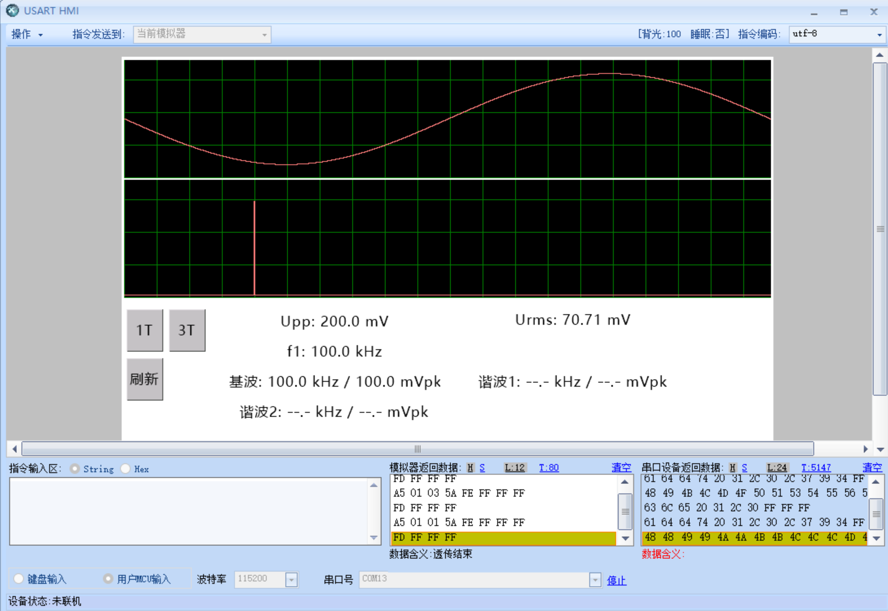
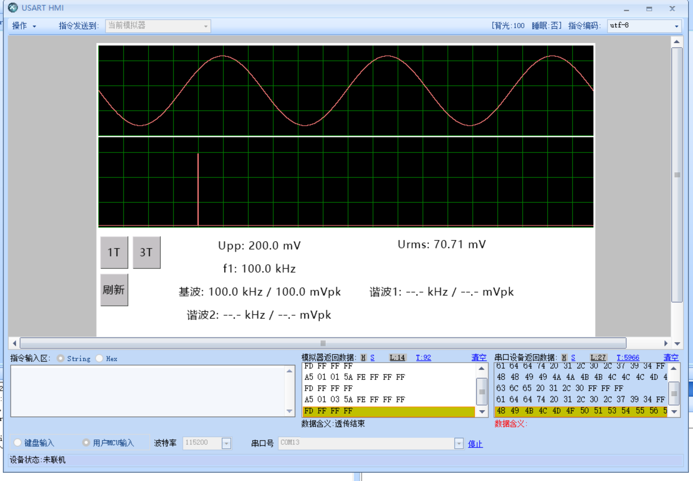

# Dashboard V1.3.1 显示基线发布与故障复盘

发布日期：2026-07-30

适用工程：`projects/tjc_display_demo`

配套HMI：淘晶驰X2七英寸单页面工程
`projects/tjc_display_demo/HMI/TJC8048X270_dashboard_v1.3.1.HMI`

## 发布结论

V1.3.1 已在 USART HMI 模拟器中完成回归：

- 1T 模式稳定显示一个完整周期；
- 3T 模式稳定显示三个完整周期；
- 频谱在 100 kHz 位置显示单根谱线；
- `Upp`、`Urms`、基频和三个频谱分量文本均正常显示；
- 曲线透传均完成 `FE FF FF FF` 与 `FD FF FF FF` 握手；
- 未观察到 `0x12`、`0x1A`、`0x1C` 或 `0x24` 错误。

当前仍使用显示模块内部生成的 100 kHz、100 mV 峰值正弦和 256 点演示 DFT。本次发布冻结的是显示链路，不代表真实 ADC/FFT 数据已经接入。

## 故障表现

失败版本曾依次出现以下现象：

1. 点击 1T/3T 后没有任何曲线；
2. 时域曲线恢复后，频谱仍为空；
3. 六项文本始终停留在 HMI 占位值；
4. MCU 与 HMI 启动顺序变化时，结果不稳定。

这些现象并非一个单独错误，而是三个问题叠加后形成的故障链。

## 根因分析

### 1. Dashboard 首次握手缺少恢复路径

`Display_Init()`上电时只发送一次：

```text
page dashboard
```

如果 MCU 已经运行，而 HMI 模拟器随后才连接，这条一次性指令可能丢失。页面就不会执行后初始化事件，也不会发送：

```text
A5 20 01 time_id spec_id 5A
```

此时 MCU 没有两条曲线的有效数字 ID，不能可靠地绘制完整页面。

修复方法是在 `testv2.HMI` 中增加刷新按钮 `b2`：

```text
A5 01 02 5A
```

MCU 收到后重新发送 `page dashboard`，并等待页面重新上报 `s_time` 和 `s_spec` 的实际数字 ID，再执行完整刷新。

### 2. 频谱失败会提前终止全部文本更新

旧版 `Display_DrawDashboard()`严格串行执行：

```text
时域曲线 -> 频谱曲线 -> 六项文本
```

只要频谱 `cle/addt` 返回错误或超时，函数就在文本更新前直接返回。因此现场表现为：

```text
时域有图 + 频谱无图 + 所有文字仍为占位符
```

这使一个局部曲线问题看起来像整套文本通信也损坏了。

修复后，时域与频谱分别记录状态；无论频谱是否成功，六项测量文本都会继续更新。若频谱失败，`t_c3`临时显示：

```text
频谱错误: ID=<id> HAL=<status> HMI=<code>
```

由此可以直接区分曲线 ID、HAL 返回值和淘晶驰状态码。

### 3. newlib-nano 未启用浮点 printf

STM32CubeIDE Debug 链接命令使用：

```text
--specs=nano.specs
```

但没有链接 `_printf_float`。旧版通过 `vsnprintf("%.1f")` 和 `%.2f` 生成文本，浮点字段不能稳定输出。

修复后不修改链接配置，也不引入浮点 printf，而是：

1. 将浮点测量值四舍五入为十倍或百倍定点整数；
2. 使用 `%lu` 分别输出整数部分和小数部分；
3. 再通过 `TJC_SetText()`发送完整字符串。

例如 70.710678 mV 被格式化为：

```text
Urms: 70.71 mV
```

### 4. HMI 与固件必须版本配套

当前有效上位机工程是单页面 `testv2.HMI`。`testv1.HMI`属于旧的双页面版本，其页面结构和协议不能与 V1.3.1 固件混用。

本轮没有修改演示正弦、演示 DFT、频谱横向映射、USART3、PC10/PC11、115200 bit/s 或 `addt -> FE -> data -> FD` 传输协议。相同 DFT 在 dashboard 重新初始化并重新绑定真实曲线 ID 后正常显示，说明此前频谱缺失属于页面初始化/曲线绑定链路问题，不是频谱算法本身失效。

## 本次代码修改

`Core/Src/display.c`完成以下修改：

- 新增 `UI_ACTION_RELOAD_DASHBOARD`；
- 解析刷新帧 `A5 01 02 5A`；
- 刷新时清除 dashboard 有效状态并重新执行 `page dashboard`；
- 删除依赖浮点 `printf` 的 `TJC_SetTextFormat()`；
- 新增 `Display_ToUnsignedFixed()`；
- 六项测量值统一改为定点整数格式化；
- `Display_DrawDashboard()`不再因频谱失败跳过文本；
- 新增 `Display_ShowSpectrumError()`现场诊断；
- 保留动态曲线 ID、演示数据、频谱方向与 FE/FD 握手。

没有修改：

- `main.c`和CubeMX生成初始化；
- `.ioc`、USART3、PC10/PC11和115200波特率；
- `projects/teammate_adc_reference`；
- 模拟正弦和256点演示DFT；
- 1T/3T的时域重采样算法；
- 频谱100 kHz位于0～500 kHz横轴左侧约20%的映射。

## HMI 配套修改

正式单页面工程为 `testv2.HMI`。Dashboard 后初始化事件必须是：

```text
printh A5 20 01
prints s_time.id,1
prints s_spec.id,1
printh 5A
```

按钮弹起事件：

```text
b0: printh A5 01 01 5A
b1: printh A5 01 03 5A
b2: printh A5 01 02 5A
```

三个按钮都不勾选“发送键值”。

归档文件信息：

```text
文件大小：13228111 bytes
SHA-256：3402CB36ACB58D3BBE8CAC1E506566D7A86B24DFDAC025282F58E73ECBEE7D84
```

## 回归证据

### 1T



### 3T



画面验证值：

```text
Upp: 200.0 mV
Urms: 70.71 mV
f1: 100.0 kHz
基波: 100.0 kHz / 100.0 mVpk
```

## 构建验证

使用 STM32CubeIDE 2.1.0 自带 GNU Tools for STM32 14.3 执行完整 Clean Build：

```text
0 errors
0 warnings
text = 23880 B
data = 96 B
bss  = 4920 B
total = 28896 B
```

发布产物同时生成 ELF 与 Intel HEX。

```text
TJC_sine_test.elf
SHA-256: 9ED6562599BDCA00192352AAD6DD66039DC6A937CB1D9268070C055BBFCF5A22

TJC_sine_test.hex
SHA-256: EDDE052F18EC39DB64D8EA4B3CF1B54479155D7B1FF238C00382AAE52F0F909D
```

## 冻结边界

后续接入队友真实数据前，不再改动：

- Dashboard 6字节初始化帧；
- 1T、刷新、3T三个按钮帧；
- 两条曲线动态 ID 上报；
- 794×145曲线尺寸；
- `addt -> FE -> data -> FD`握手；
- 文本定点格式化；
- 已验证的频谱横向方向。

后续只替换演示数据源和结果接口，不把显示链路与队友未经验证的信号处理代码同时改动。
