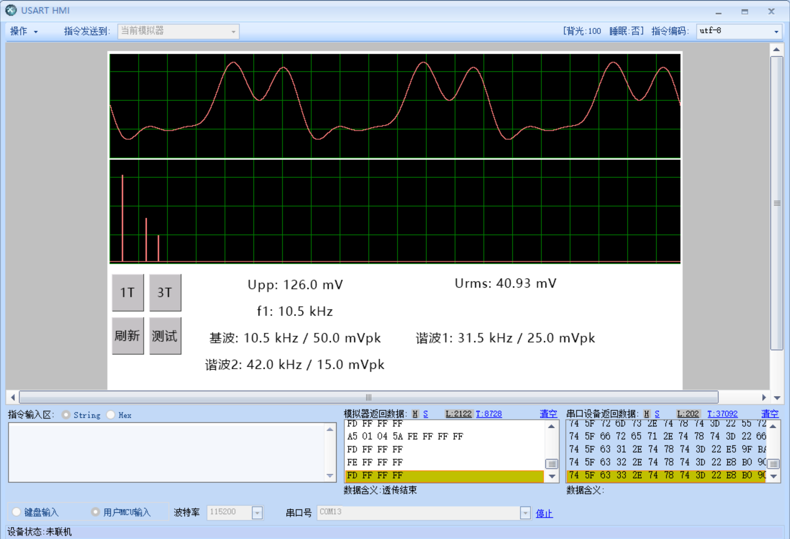
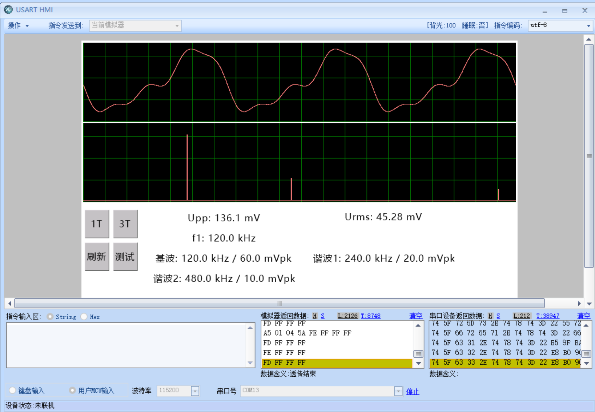

# V1.4屏幕融合测试指南

更新时间：2026-07-30  
固件工程：`projects/g474_full_integration_test`

## 前提

- 淘晶驰HMI：V1.3.1 dashboard单页面布局；
- USART3：PC10/PC11，115200 bit/s，8N1；
- dashboard后初始化仍需上报两条真实曲线ID：

```text
A5 20 01 time_id spec_id 5A
```

- 测试按钮弹起事件发送：

```text
A5 01 04 5A
```

- 使用自定义 `printh` 协议的按钮不要勾选“发送键值”。

## 每次按测试键的行为

MCU收到完整的 `A5 01 04 5A` 后：

1. 只调用 `AnalyzerBridge_RunRandomTest()`；
2. 从6个预定义场景中随机选择一个；
3. 避免与上一轮连续选择同一场景；
4. 生成256点一致时域波形；
5. 从波形计算Vpp和Vrms；
6. 锁存测试结果并增加sequence；
7. 由 `Display_RedrawCurrentPage()`安排dashboard刷新；
8. 时域、频谱和六项文字均读取同一个 `AnalyzerResult`。

测试注入在最终结果层完成，不伪造ADC数据，也不运行显示侧DFT。

## 六个测试场景

| 场景 | 频谱分量（峰值） | 256点波形计算的Vpp | 256点波形计算的Vrms |
|---|---|---:|---:|
| 1 | 10.5 kHz/50 mV；31.5 kHz/25 mV；42 kHz/15 mV | 126.008 mV | 40.927 mV |
| 2 | 25 kHz/70 mV；50 kHz/20 mV；75 kHz/10 mV | 154.896 mV | 51.962 mV |
| 3 | 80 kHz/80 mV；160 kHz/30 mV | 187.664 mV | 60.415 mV |
| 4 | 120 kHz/60 mV；240 kHz/20 mV；480 kHz/10 mV | 136.082 mV | 45.277 mV |
| 5 | 200 kHz/75 mV；400 kHz/25 mV | 170.220 mV | 55.902 mV |
| 6 | 250 kHz/55 mV；500 kHz/15 mV | 121.281 mV | 40.311 mV |

屏幕保留一位Vpp、两位RMS以及一位频率/峰值小数，允许出现对应的显示舍入。

## 按钮验证顺序

1. 上电或点击“刷新”，等待dashboard曲线ID上报；
2. 点击测试按钮，确认时域、频谱和文字同时变化；
3. 连续点击6次以上，确认场景变化且没有连续重复；
4. 点击`1T`，确认时域窗口显示一个完整周期；
5. 点击`3T`，确认同一测试波形显示三个完整周期；
6. 再次点击测试按钮，确认当前1T/3T模式保持不变，但场景更新；
7. 点击“刷新”，确认仍显示锁存的当前测试结果。

## 频谱验证

频谱横轴固定为0～500 kHz，谱线位置应按频率比例出现。例如：

- 100 kHz位于从左到右约20%；
- 250 kHz位于中间；
- 500 kHz位于最右端。

频谱由场景分量或队友FFT输出直接绘制，不应出现显示侧DFT产生的额外谱线。
显示代码保留V1.3.1已经验证的淘晶驰整帧横向反转处理。

## 串口返回

每条曲线正常透传应看到：

```text
FE FF FF FF
FD FF FF FF
```

不得出现：

```text
12 FF FF FF
1A FF FF FF
1C FF FF FF
24 FF FF FF
```

若按键有返回但没有图形，优先确认dashboard初始化帧是否包含当前HMI工程中
`s_time`和`s_spec`的真实数字ID。

## 正式模式

将 `Core/Inc/analyzer_bridge.h` 中：

```c
#define ANALYZER_TEST_ENABLE 1U
```

改为0后重新Clean Build，即可关闭随机测试覆盖。真实模式继续从队友FFT、
Vpp和RMS结果发布到同一个 `AnalyzerResult`，显示模块无需改动。

## 2026-07-30实际回归

本指南已在STM32G474实机固件、ST-Link和USART HMI模拟器组合下完成回归。

### 场景1



- 基波10.5 kHz / 50.0 mVpk；
- 谐波31.5 kHz / 25.0 mVpk；
- 谐波42.0 kHz / 15.0 mVpk；
- 显示Upp 126.0 mV、Urms 40.93 mV。

### 场景4



- 基波120.0 kHz / 60.0 mVpk；
- 谐波240.0 kHz / 20.0 mVpk；
- 谐波480.0 kHz / 10.0 mVpk；
- 显示Upp 136.1 mV、Urms 45.28 mV。

两组均观察到正常FE/FD透传结束帧，时域、频谱和文本同步更新。
